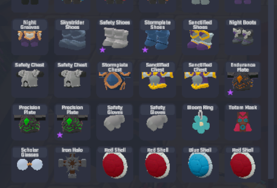

# SpiritVale Sell Favorite（紫星販賣保護）

遊戲原生「收藏」（黃星，hover + `F`）只是一般收藏，在商人販賣介面完全不設防，
物品一多就容易賣錯。本插件加入第二套獨立的「紫星」標記，專門保護物品不被賣掉：



（左下角帶紫色 ★ 的物品＝已受保護，點擊與「全部出售」都無法把它加入販賣清單）

## 給玩家：三步安裝

1. 到 [Releases](https://github.com/Jyo238/SpiritVale-SellFavorite/releases) 下載最新的 `SpiritValeSellFavorite_vX.X.X.zip`
2. 完整解壓縮後，關閉遊戲，雙擊 **`一鍵安裝.bat`**（自動偵測遊戲位置；沒裝過 BepInEx 會自動下載安裝）
3. 開遊戲。**首次啟動會多花 1~3 分鐘初始化，畫面停住是正常的**（已裝繁中翻譯包者無此等待）

與社群的「繁中翻譯包」「詞條快篩 HUD」完全相容可共存。
出問題請雙擊 `產生診斷報告.bat`，把桌面上生成的報告貼到回報處。
**更新方式**：下載新版 zip 後重跑 `一鍵安裝.bat` 即可（會自動偵測並覆蓋舊版）。

| 位置 | 按鍵 | 行為 |
|---|---|---|
| 商店・人物端（自己的背包） | `F`（可改設定） | 切換紫星；紫星物品無法加入販賣清單（點擊與 Sell All 都會被擋） |
| 商店・商人端（販賣清單） | `F` | 直接標上紫星並退回背包 |
| 一般背包畫面 | `F` | 維持遊戲原生黃星行為，不受影響 |

- 紫星狀態存在 `BepInEx\config\local.spiritvale.sellfavorite.marks.txt`，重開遊戲不會消失。
- 設定檔：`BepInEx\config\local.spiritvale.sellfavorite.cfg`（首次啟動後自動生成）：
  紫星熱鍵、是否同時保護「分解」模式、診斷模式。
- 純 client 端行為：只擋「把物品加入販賣清單」的本地操作，不改數值、不偽造封包、不碰存檔。

## 技術

- BepInEx 6（IL2CPP）+ HarmonyX + Il2CppInterop，作法與 [SpiritVale-SubstatHUD](https://github.com/sky919247us/SpiritVale-SubstatHUD) 同一套。
- 擋賣：`UIMerchantSell.AddItem` prefix（點擊與 SellAll 兩條路徑都收斂到它，ISIL 驗證）＋ `SellAll` postfix 保險清掃。
  刻意不動 `CanSell` —— 它同時是販賣畫面的顯示過濾器（原生黃星因此在商店被整個藏起來），
  紫星的差異化價值就是「留在畫面上、可管理、但賣不掉」。
- 商店開啟時 prefix 攔截 `PlayerSave.ToggleFavorite`，同一顆 `F` 鍵在商店內改走紫星、不動黃星。
- 紫星圖示為紫色 ★（TMP 文字），與黃星圖示（`UIInventoryItem.Favorite`）同位置。
- 商人端退回：迭代 `Transaction.Items`（Dictionary&lt;String, TransactionInventoryItem&gt;，鍵＝InstanceId）
  找出清單內物件 → `RemoveItem` + **`Redraw`**——遊戲的 AddItem/RemoveItem 只改資料不刷畫面，
  原生點擊路徑是呼叫端補 `UIMerchantSell.Redraw(item)`，必須照抄。
- 每幀入口掛在 `UIManager.LateUpdate` 的 Harmony postfix——
  **不可用 AddComponent/ClassInjector 注入元件**：Il2CppInterop 的類別注入 hook
  （`Class_FromIl2CppType` 等）在本遊戲（Unity 6000.0.64）場景載入時會 AccessViolation 直接閃退。

## 建置

```powershell
dotnet build src\SpiritValeSellFavorite.csproj -c Release
# 需先讓遊戲（裝好 BepInEx）跑過一次，產生 BepInEx\interop\
# 產出 DLL 複製到 <遊戲目錄>\BepInEx\plugins\SpiritValeSellFavorite\
```
